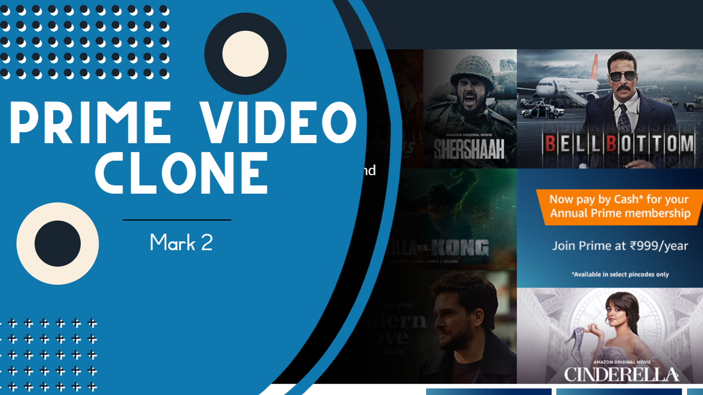

# Prime Video Clone



## Description

Discover a captivating streaming experience with our Prime Video clone website. Crafted with HTML, CSS, and Javascript, it offers a vast library of movies and TV shows for your enjoyment. Immerse yourself in high-quality content, user-friendly navigation, and personalized recommendations, all within a sleek and intuitive interface. Start binge-watching today!

## Technologies Used

- HTML (Hypertext Markup Language): The standard markup language for creating web pages and web applications.
- CSS (Cascading Style Sheets): A styling language used to control the presentation and design of web pages.
- JavaScript: A versatile and widely-used programming language for web development.

## Getting Started

To run the Prime Video Clone locally, follow these steps:

1. Clone the repository to your local machine:

   ```bash
   git clone https://github.com/Mukesh-Sharma400/Prime-Video-Clone.git
   ```

2. Start the Live Server from the VS Code Extensions.
